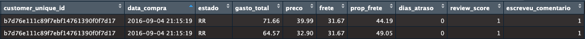

# Introdução e Objetivos

Este relatório apresenta uma análise detalhada da base de dados pública da **Olist**, o maior ecossistema de *e-commerce* do Brasil. O objetivo central deste estudo é mapear a eficiência logística e investigar como o desempenho das entregas atua como um determinante direto na retenção e na satisfação do consumidor final. Em um país com dimensões continentais e desafios complexos, a logística deixa de ser apenas um suporte operacional para se tornar o principal motor de experiência do cliente.

A investigação inicia-se pela análise da "dor do cliente", buscando quantificar o impacto dos atrasos logísticos na satisfação do consumidor. Nesse contexto, explorou-se o comportamento de engajamento dos usuários através de três pilares: os comentários nas avaliações, o status de entrega e atrasos e as avaliações gerais.

Adicionalmente, o estudo aprofunda-se nas disparidades geográficas brasileiras, analisando como a localização do consumidor e a proporção do custo do frete no valor total do pedido influenciam a percepção de valor e a viabilidade da compra.

Por fim, utilizando metodologias de análise exploratória e modelagem estatística, este trabalho foca na recorrência e no risco de *churn*. O intuito é compreender o intervalo entre compras e o peso que uma experiência de entrega positiva exerce na probabilidade de fidelização.

------------------------------------------------------------------------

# Preparação de Dados

A base de dados utilizada neste projeto é proveniente do ecossistema público da **Olist**, disponível via Kaggle. Para garantir a integridade das análises estatísticas, toda a etapa de ETL e tratamento de dados foi desenvolvida em linguagem **R**, utilizando o ecossistema *Tidyverse* (principalmente os pacotes `dplyr`, `tidyr` e `vroom` para leitura eficiente de grandes volumes).

## Agrupamento de Itens 

Durante a fase de exploração, foi identificado uma característica estrutural que poderia enviesar significativamente os resultados de satisfação e logística: a base original estava segmentada por item de pedido, e não por pedido único. 

Isso significa que, se um cliente comprasse cinco itens em uma única transação ("carrinho"), o banco de dados gerava cinco linhas distintas. Como os indicadores de atraso, nota de avaliação e comentários são atribuídos ao pedido como um todo, o cálculo geraria um viés, superestimando o peso de pedidos com múltiplos itens.

::: {#fig-agrupamento}


Exemplo de redundância estrutural onde um único pedido gera múltiplas entradas, duplicando métricas de satisfação e atraso.
:::

Para mitigar esse viés, os dados foram agrupados por ID único de cliente e data de compra, consolidando os valores financeiros e mantendo a unicidade dos indicadores qualitativos. 

Esta metodologia permitiu que cada experiência de compra fosse contabilizada como uma unidade estatística única, garantindo que as análise reflitam a realidade da jornada do consumidor, independentemente da quantidade de produtos adquiridos em uma mesma transação.

```{r}
#| label: setup-dados
#| code-summary: "Mostrar script de Limpeza de Dados"

library(tidyverse)
library(lubridate)
library(ggridges)
library(scales)

setwd("/Users/imac/Desktop/ /Projeto_Ecommerce/dataset_ecmm")

# Lendo os dados (Substitua pelos caminhos corretos caso necessário)
df_clientes <- read_csv("olist_customers_dataset.csv")
df_pedidos  <- read_csv("olist_orders_dataset.csv")
df_itens    <- read_csv("olist_order_items_dataset.csv")
df_reviews  <- read_csv("olist_order_reviews_dataset.csv")

data_completo <- df_pedidos %>%
  left_join(df_clientes, by = "customer_id") %>%
  left_join(df_itens, by = "order_id") %>%
  left_join(df_reviews, by = "order_id") 

# Tratamento e agregação (Cart Splitting)
data_limpo <- data_completo %>%
  mutate( 
    data_compra = ymd_hms(order_purchase_timestamp),
    data_entrega = ymd_hms(order_delivered_customer_date),
    data_estimada = ymd(order_estimated_delivery_date),
    preco = as.numeric(price),
    frete = as.numeric(freight_value),
    gasto_total = preco + frete, 
    diferenca_dias = as.integer(difftime(data_entrega, data_estimada, units = "days")),
    status_entrega = case_when(
      is.na(diferenca_dias) ~ "Não Entregue",
      diferenca_dias < 0 ~ "Adiantado",
      diferenca_dias == 0 ~ "Prazo Exato",
      diferenca_dias > 0 ~ "Atrasado"),
    dias_atraso = ifelse(is.na(diferenca_dias) | diferenca_dias <= 0, 0, diferenca_dias),
    escreveu_comentario = ifelse(is.na(review_comment_message) | review_comment_message == "", 0, 1),
    estado = as.factor(customer_state)
  ) %>%
  group_by(order_id, customer_unique_id, data_compra, estado) %>%
  summarise(
    itens_no_pedido = n(),                               
    preco_total = sum(preco, na.rm = TRUE),              
    frete_total = sum(frete, na.rm = TRUE),              
    gasto_total = sum(gasto_total, na.rm = TRUE), 
    diferenca_dias = first(diferenca_dias),
    status_entrega = first(status_entrega),
    dias_atraso = max(dias_atraso, na.rm = TRUE), 
    review_score = first(review_score),                  
    escreveu_comentario = max(escreveu_comentario, na.rm = TRUE), 
    .groups = "drop"
  ) %>%
  mutate(prop_frete = round((frete_total / gasto_total) * 100, 2))
```

------------------------------------------------------------------------

# Análise de Atrasos e Avaliações

Nesta seção, exploramos a distribuição do tempo de entrega e como o consumidor reage a quebras de expectativa logística. Utilizamos abas para separar a visão da logística operacional e a reação do consumidor.

::: panel-tabset
## 📦 Logística: Volume e Atrasos

A maior parte da operação da Olist flui de forma adiantada, demonstrando folga nas estimativas de frete. Contudo, quando a falha ocorre, a distribuição dos dias de atraso se revela severa e com forte assimetria à direita.

```{r}
#| layout-ncol: 2
#| fig-width: 12
#| fig-height: 8
#| out-width: "100%"
#| fig-dpi: 300

# 1. Gráfico de Status
cores_status <- c("Adiantado" = "#1A9850", "Prazo Exato" = "#377EB8", "Atrasado" = "#D73027")

stats_status <- data_limpo %>%
  filter(!is.na(status_entrega), status_entrega != "Não Entregue") %>%
  count(status_entrega) %>%
  mutate(
    proporcao = n / sum(n),
    status_entrega = factor(status_entrega, levels = c("Adiantado", "Prazo Exato", "Atrasado")))

ggplot(stats_status, aes(x = status_entrega, y = n, fill = status_entrega)) +
  geom_col(alpha = 0.9, width = 0.7) +
  geom_text(aes(label = paste0(format(n, big.mark = ".", scientific = FALSE), "\n(", scales::percent(proporcao, accuracy = 0.1, decimal.mark = ","), ")")), 
            vjust = -0.3, size = 3.5, fontface = "bold", color = "grey20", lineheight = 0.9) +
  scale_fill_manual(values = cores_status, guide = "none") +
  scale_y_continuous(expand = expansion(mult = c(0, 0.15))) +
  theme_minimal(base_size = 14) +
  labs(title = "Status das Entregas", subtitle = "Cenários de entrega", x = "", y = "Pedidos") +
  theme(plot.title = element_text(face = "bold", size = 16), panel.grid.major.x = element_blank())

# 2. Histograma de Atrasos
stats_atraso <- data_limpo %>%
  filter(dias_atraso > 0) %>%
  summarise(mediana = median(dias_atraso, na.rm = TRUE), p90 = quantile(dias_atraso, 0.90, na.rm = TRUE))

data_limpo %>%
  filter(dias_atraso > 0) %>%
  ggplot(aes(x = dias_atraso)) +
  geom_histogram(binwidth = 2, fill = "#D73027", color = "white", alpha = 0.85) +
  geom_vline(xintercept = stats_atraso$mediana, color = "black", linetype = "dashed", linewidth = 0.8) +
  annotate("text", x = stats_atraso$mediana + 1.5, y = 1650, label = paste("Mediana:", stats_atraso$mediana, "dias"), angle = 90, vjust = -0.5, fontface = "bold") +
  geom_vline(xintercept = stats_atraso$p90, color = "black", linetype = "dashed", linewidth = 0.8) +
  annotate("text", x = stats_atraso$p90 + 1.5, y = 1700, label = paste("P90:", stats_atraso$p90, "dias"), angle = 90, vjust = -0.5, fontface = "bold") +
  coord_cartesian(xlim = c(0, stats_atraso$p90 * 1.5)) + 
  theme_minimal(base_size = 14) +
  labs(title = "Atrasos Logísticos", subtitle = "Distribuição de dias", x = "Dias de Atraso", y = "") +
  theme(plot.title = element_text(face = "bold", size = 16))
```

## ⭐ Satisfação e Quebra de Expectativa

Ao cruzar a variável de atrasos com o *Review Score*, o impacto fica cristalino. O Ridgeline Plot abaixo prova visualmente que notas altas toleram pouquíssimo tempo de atraso, enquanto as avaliações com nota 1 se arrastam pela cauda longa.

```{r}
#| label: plots-satisfacao
#| layout-ncol: 2
#| fig-height: 5

# 1. Gráfico de Barras Notas
cores_satisfacao <- c("1" = "#D73027", "2" = "#FC8D59", "3" = "#FEE08B", "4" = "#A6D96A", "5" = "#1A9850")

stats_avaliacoes <- data_limpo %>% filter(!is.na(review_score)) %>% count(review_score) %>% mutate(proporcao = n / sum(n))

ggplot(stats_avaliacoes, aes(x = as.factor(review_score), y = n, fill = as.factor(review_score))) +
  geom_col(alpha = 0.9, width = 0.7) +
  geom_text(aes(label = paste0(format(n, big.mark = ".", scientific = FALSE), "\n(", scales::percent(proporcao, accuracy = 0.1), ")")), 
            vjust = -0.3, size = 3, fontface = "bold", color = "grey20", lineheight = 0.9) +
  scale_fill_manual(values = cores_satisfacao, guide = "none") +
  scale_y_continuous(expand = expansion(mult = c(0, 0.15))) +
  theme_minimal(base_size = 14) +
  labs(title = "Satisfação Geral", subtitle = "Distribuição das notas", x = "Nota", y = "Pedidos") +
  theme(plot.title = element_text(face = "bold", size = 16), panel.grid.major.x = element_blank())

# 2. Ridgeline Plot
data_limpo %>%
  filter(dias_atraso > 0, !is.na(review_score)) %>% 
  ggplot(aes(x = dias_atraso, y = as.factor(review_score), fill = as.factor(review_score))) +
  geom_density_ridges(alpha = 0.8, scale = 1.5, rel_min_height = 0.01) +
  scale_fill_manual(values = cores_satisfacao, guide = "none") +  
  coord_cartesian(xlim = c(0, quantile(data_limpo$dias_atraso[data_limpo$dias_atraso > 0], 0.90, na.rm=TRUE) * 1.5)) + 
  theme_ridges(font_size = 13, grid = TRUE) +
  labs(title = "Impacto do Atraso", subtitle = "A curva da impaciência", x = "Dias de Atraso", y = "Nota") +
  theme(plot.title = element_text(face = "bold", size = 16))
```

> **Rigor Estatístico:** Para quantificar este fenômeno, aplicou-se a **Correlação de Rank de Spearman**. Como a avaliação é uma variável ordinal discreta, utilizou-se o coeficiente $\rho$ (rho). O teste revelou uma correlação negativa ($p < 0.001$) de **-0.40**, um tamanho de efeito moderado-forte para comportamento humano, cravando o atraso como o principal ofensor do NPS.

## 🗣️ A Curva do Engajamento

As métricas absolutas mostraram que a nota 5 é a mais comum. Porém, quando analisamos o **comportamento de justificar o voto**, a história muda. Formata-se a clássica "Curva em U": o ódio engaja muito mais que a satisfação, tornando os comentários de notas baixas minas de ouro para algoritmos de NLP (Processamento de Linguagem Natural).

```{r}
#| label: plot-engajamento
#| fig-width: 8
#| fig-height: 5

stats_engajamento <- data_limpo %>%
  filter(!is.na(review_score), !is.na(escreveu_comentario)) %>%
  mutate(comportamento = factor(ifelse(escreveu_comentario == 1, "Escreveram Comentário", "Não Escreveram Comentário"), levels = c("Escreveram Comentário", "Não Escreveram Comentário"))) %>%
  count(review_score, comportamento) %>%
  group_by(review_score) %>%
  mutate(proporcao = n / sum(n)) %>% ungroup()

cores_engajamento <- c("Escreveram Comentário" = "#2C7FB8", "Não Escreveram Comentário" = "darkgray")

ggplot(stats_engajamento, aes(x = as.factor(review_score), y = proporcao, fill = comportamento)) +
  geom_col(position = "fill", width = 0.7, color = "white", linewidth = 0.5) +
  geom_text(aes(label = scales::percent(proporcao, accuracy = 0.1, decimal.mark = ",")), 
            position = position_stack(vjust = 0.5), size = 4, fontface = "bold", 
            color = ifelse(stats_engajamento$comportamento == "Escreveram Comentário", "white", "black")) +
  scale_fill_manual(values = cores_engajamento) +
  scale_y_continuous(labels = scales::percent_format(decimal.mark = ","), expand = expansion(mult = c(0, 0.05))) +
  theme_minimal(base_size = 14) +
  labs(title = "A Polarização do Engajamento", subtitle = "Proporção de comentários para cada nota atribuída", x = "Nota da Avaliação", y = "Proporção", fill = "") +
  theme(plot.title = element_text(face = "bold", size = 16), panel.grid.major.x = element_blank(), legend.position = "top") 
```
:::
